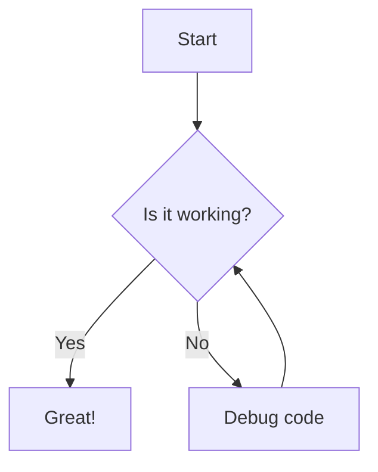

# Markdown Syntax Cheat Sheet & Reference Guide

A comprehensive, ultimate reference for Markdown syntax, including standard Markdown, GitHub Flavored Markdown (GFM), and advanced formatting techniques.

---

## Table of Contents
1. [Headers](#headers)
2. [Emphasis & Text Formatting](#emphasis--text-formatting)
3. [Lists](#lists)
   - [Unordered Lists](#unordered-lists)
   - [Ordered Lists](#ordered-lists)
   - [Task Lists](#task-lists)
   - [Definition Lists](#definition-lists)
4. [Links](#links)
5. [Images](#images)
6. [Blockquotes](#blockquotes)
7. [Code & Syntax Highlighting](#code--syntax-highlighting)
8. [Tables](#tables)
9. [Horizontal Rules](#horizontal-rules)
10. [Footnotes](#footnotes)
11. [Strikethrough, Subscript, Superscript & Highlights](#advanced-typography)
12. [Collapsible Sections (Details)](#collapsible-sections)
13. [Emojis](#emojis)
14. [Diagrams & Charts (Mermaid.js)](#diagrams--charts)
15. [LaTeX Math Equations](#latex-math-equations)
16. [HTML in Markdown](#html-in-markdown)
17. [GitHub Callouts / Alerts](#github-callouts--alerts)
18. [Escaping Characters](#escaping-characters)

---

## Headers

Headers are created using `#` before the text. The number of `#` symbols corresponds to the header level (1–6).

```markdown
# Heading Level 1
## Heading Level 2
### Heading Level 3
#### Heading Level 4
##### Heading Level 5
###### Heading Level 6
```

### Alternative Header Syntax (Setext-style)
For Level 1 and Level 2 headers, you can also underline the text:

```markdown
Heading Level 1
===============

Heading Level 2
---------------
```

---

## Emphasis & Text Formatting

Styling text with bold, italics, strikethrough, and custom formatting.

| Style | Syntax | Output |
| :--- | :--- | :--- |
| **Italics** | `*italic*` or `_italic_` | *italic* |
| **Bold** | `**bold**` or `__bold__` | **bold** |
| **Bold & Italic** | `***bold & italic***` | ***bold & italic*** |
| **Strikethrough** | `~~strikethrough~~` | ~~strikethrough~~ |
| **Subscript** | `~subscript~` *(extended)* or `<sub>sub</sub>` | H<sub>2</sub>O |
| **Superscript** | `^superscript^` *(extended)* or `<sup>sup</sup>` | E = mc<sup>2</sup> |
| **Highlight** | `==highlighted==` *(extended)* or `<mark>mark</mark>` | <mark>highlighted</mark> |

---

## Lists

### Unordered Lists
Use `-`, `*`, or `+` followed by a space.

```markdown
- Item 1
- Item 2
  - Subitem 2.1
  - Subitem 2.2
* Item 3
+ Item 4
```

### Ordered Lists
Use numbers followed by a period.

```markdown
1. First step
2. Second step
3. Third step
   1. Sub-step 3.1
   2. Sub-step 3.2
```

### Task Lists (Checkboxes)
Used in GFM for interactive action items.

```markdown
- [x] Completed task
- [ ] Incomplete task
- [ ] Another pending task
```

### Definition Lists (Extended Syntax)
```markdown
Term 1
: Definition 1

Term 2
: Definition 2
```

---

## Links

### Inline Links
```markdown
[Google](https://www.google.com)
[Google with Title](https://www.google.com "Google's Homepage")
```

### Reference-Style Links
Useful for keeping markdown text clean and easy to read.

```markdown
Here is a link to [Google][1] and another to [GitHub][2].

[1]: https://www.google.com "Google"
[2]: https://github.com "GitHub"
```

### Relative Links (Document Anchor Navigation)
```markdown
[Jump to Table of Contents](#table-of-contents)
```

### Automatic Links
```markdown
<https://www.example.com>
<user@example.com>
```

---

## Images

### Inline Image
```markdown

```

### Reference-Style Image
```markdown
![Alt Text][image-ref]

[image-ref]: https://via.placeholder.com/150 "Optional Title"
```

### Image with Custom Size (Using HTML)
```html

```

---

## Blockquotes

Use `>` to create blockquotes. Blockquotes can be nested.

```markdown
> This is a single-line blockquote.
>
> > This is a nested blockquote.
> > It spans multiple lines.
```

---

## Code & Syntax Highlighting

### Inline Code
Wrap text in single backticks `` ` ``.

```markdown
Use `printf()` function in C.
```

### Fenced Code Blocks
Wrap code blocks in triple backticks ` ``` ` and specify the programming language for syntax highlighting.

````markdown
```python
def greet(name):
    print(f"Hello, {name}!")

greet("World")
```

```javascript
function greet(name) {
    console.log(`Hello, ${name}!`);
}
greet("World");
```

```html
<!DOCTYPE html>
<html>
<body>
    <h1>Hello World</h1>
</body>
</html>
```
````

---

## Tables

Tables are created using pipes `|` and hyphens `-`.

```markdown
| Header 1 | Header 2 | Header 3 |
| :---     | :----:   |    ---: |
| Left-aligned | Centered | Right-aligned |
| Row 2 Cell 1 | Cell 2   | Cell 3 |
| Row 3 Cell 1 | Cell 2   | Cell 3 |
```

---

## Horizontal Rules

Create a horizontal rule using three or more hyphens `---`, asterisks `***`, or underscores `___`.

```markdown
---
***
___
```

---

## Footnotes

Create footnotes using `[^1]` notation.

```markdown
Here is a sentence with a footnote reference.[^1]

[^1]: This is the text explaining the footnote.
```

---

## Advanced Typography

### Strikethrough, Subscript, Superscript, Underline

```markdown
~~Strikethrough text~~
<u>Underlined text (HTML tag)</u>
H<sub>2</sub>O (Subscript via HTML)
X<sup>2</sup> (Superscript via HTML)
```

---

## Collapsible Sections

Use the `<details>` and `<summary>` HTML tags to create collapsible accordion sections.

```html
<details>
  <summary>Click to expand/collapse section</summary>

  Here is hidden content that can contain **Markdown**, code blocks, or images.

  ```python
  print("Inside hidden block")
  ```
</details>
```

---

## Emojis

GitHub and many Markdown parsers support shortcodes for emojis:

```markdown
:smile: :rocket: :tada: :fire: :thumbsup: :sparkles: :bug:
```

Output: 😄 🚀 🎉 🔥 👍 ✨ 🐛

---

## Diagrams & Charts (Mermaid.js)

Supported in GitHub, GitLab, and Notion Markdown renderers.

````markdown

````

---

## LaTeX Math Equations

### Inline Math
Wrap LaTeX in single dollar signs `$ ... $`.

```markdown
The famous equation is $E = mc^2$.
```

### Block / Display Math
Wrap LaTeX in double dollar signs `$$ ... $$`.

```markdown
$$
\int_{a}^{b} f(x) \, dx = F(b) - F(a)
$$
```

---

## HTML in Markdown

You can embed raw HTML tags directly inside your Markdown files for custom styling:

```html
<p style="color: red; font-weight: bold;">This is custom styled red text.</p>

<div align="center">
  <h3>Centered Heading</h3>
  <p>Centered paragraph text</p>
</div>
```

---

## GitHub Callouts / Alerts

Special GFM blockquotes that render as highlighted alert boxes on GitHub.

```markdown
> [!NOTE]
> Highlights information that users should take note of even when skimming.

> [!TIP]
> Optional information to help a user be more successful.

> [!IMPORTANT]
> Crucial information necessary for users to succeed.

> [!WARNING]
> Critical content demanding immediate user attention due to potential risks.

> [!CAUTION]
> Negative potential consequences of an action.
```

---

## Escaping Characters

To display a literal character that would otherwise be used to format text in a Markdown document, add a backslash `\` before the character.

```markdown
\*This is not italic\*
\# This is not a heading
\[This is not a link\]
\`This is not inline code\`
```
